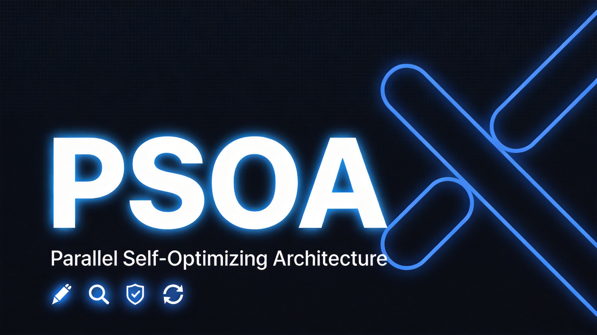
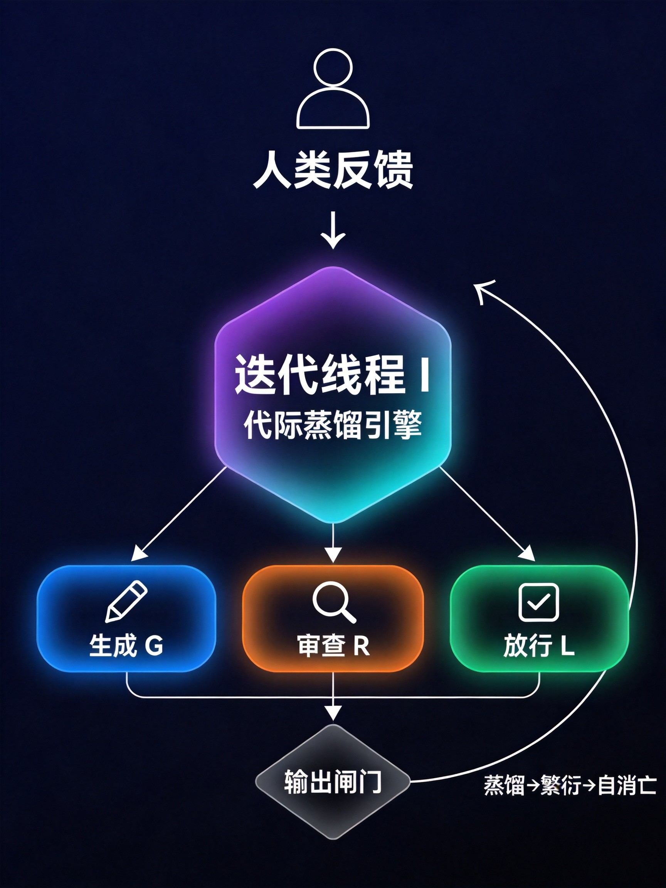

# PSOA: Parallel Self-Optimizing Architecture

<p align="center">
  
</p>

> 一种让大语言模型"自己审自己、自己改自己、自己决定什么时候改完了"的四线程并行框架。
> 它现在还在起步阶段，只是在依托大模型基座生产一些数据，虽然这些数据大多是一坨

## 这是什么？

当前 LLM 的改进方法都有结构性的问题：

- **Self-Refine** 让模型自己审自己 → 确认偏误，审不出真问题
- **多智能体辩论** 让多个模型互相挑错 → 同源模型认知同质化，辩来辩去是回音壁
- **固定轮次迭代** → 跑5轮就停，不管改没改完
- **经验无法沉淀** → 下次任务从头来

PSOA 把生成、审查、放行、迭代四个功能拆成**四个独立并行线程**，各自运行，通过消息协议协同：

```
  生成线程(G)  →  输出内容
  审查线程(R)  →  找毛病（纯负反馈）
  放行线程(L)  →  判断"这样说对了吗"（逻辑自洽性收敛）
  迭代线程(I)  →  蒸馏经验 → 生出下一代 → 自消亡
```

人类不参与每次生成，只在方向偏离时给元指令纠偏。

## 两个核心洞察

### 1. 收敛判据是"这样说对了吗"，不是打分

人类判断"说完了"的方式不是给内容打85分，而是问自己"这样说对吗"——只要逻辑自洽、前后不矛盾、自圆其说，输出就是充分的。质量分数是外挂锚点，自洽性是内生锚点。

当然，"自圆其说" ≠ "说得对"。自洽是必要条件，不是充分条件。

### 2. 迭代的是线程实例本身，不是参数

迭代线程不是给同一个模型调参，而是**代际生命周期**：

```
诞生 → 执行 → 蒸馏自身经验 → 繁衍下一代 → 自消亡
```

每一代线程把经验压缩后传给下一代作为"先天知识"，然后自己死掉。这避免了经验污染（老线程的隐式状态残留），也强制了经验显式化（不蒸馏就没法传给下一代）。

## 架构图

<p align="center">
  
</p>

<details>
<summary>文字版架构图</summary>

```
┌──────────────────────────────────────────────────┐
│              人类反馈（元指令锚定）                  │
│                    ↓                              │
│          ┌─────────────────┐                      │
│          │   迭代线程(I)    │                      │
│          │  代际蒸馏引擎    │                      │
│          └────┬────┬───────┘                      │
│        下一代  ↓    ↓ 下一代                       │
│    ┌────────┐ ┌────────┐ ┌────────┐              │
│    │生成(G) │ │审查(R) │ │放行(L) │              │
│    │ 第t代  │ │ 第t代  │ │ 第t代  │              │
│    └───┬────┘ └───┬────┘ └───┬────┘              │
│        └────→─────┘──────────┘                    │
│           候选输出  审查意见  放行信号               │
│                  ↓                               │
│            ┌───────────┐                          │
│            │  输出闸门  │──→ 最终输出              │
│            └───────────┘                          │
│                  ↓                               │
│         蒸馏→繁衍→自消亡                          │
│        生成第t+1代实例                             │
└──────────────────────────────────────────────────┘
```

</details>

## 原型验证结果

基于 Agnes AI API（兼容 OpenAI 格式）搭建了可运行的四线程原型，使用同一模型 + 不同 system prompt 模拟角色分离。

### v1 原型（初始版）

| 题目 | 类型 | 轮数 | 收敛 |
|------|------|------|------|
| 三段论推理 | 逻辑 | 1 | ✅ |
| 帽子谜题 | 逻辑 | 1 | ✅ |
| 二项分布概率 | 数学 | 1 | ✅ |
| 议论文(AI取代工作) | 写作 | **5轮不收敛** | ❌ |

**关键发现**：议论文5轮不收敛揭示了**自洽性与事实性正交**——代际蒸馏只能优化"怎么想"，不能弥补"不知道什么"。

### v2.1 原型（结构化升级版）

基于 ChatGPT/Grok/Claude 三方审查意见改进：
- R/L/I 三线程 JSON 结构化输出 + extract_json 容错
- I 线程策略进化 retained/modified/new 结构
- review_history 滑动窗口 + 压缩摘要
- L 线程 fatal_reconciliation 审计字段
- isinstance 类型保护 / 异常捕获扩宽 / 策略长度上限

| 题目 | 类型 | 轮数 | 收敛 | 备注 |
|------|------|------|------|------|
| 议论文(AI取代工作) | 写作 | 1 | ✅ | v1同题5轮不收敛 |
| 帽子谜题 | 逻辑 | 2 | ✅ | 第1轮R抓自我矛盾→I蒸馏→修复 |
| 硬币概率(3/8) | 数学 | 1 | ✅ | |
| Monty Hall三门问题 | 概率 | 2 | ✅ | R抓"换到2号"vs"换到剩余门"逻辑缺陷 |
| 虚假因果谬误检测 | 批判思维 | 1 | ✅ | |
| 贝叶斯推理(16.1%) | 概率 | 1 | ✅ | |
| 飞机升力原理 | 科学 | 3+ | ❌ | 反复在倒飞物理细节上卡住 |
| 三个门卫谜题 | 逻辑 | 3+ | ❌ | 模型无法构造正确的第二问 |

**v2.1 战绩：6/8收敛，其中4题1轮收敛，2题2轮收敛**

### 关键实验发现

1. **自洽性与事实性正交**：模型可以输出逻辑自洽但事实错误的内容。R线程抓事实错误，L线程看逻辑自洽，双重闸门可能死锁——这正是PSOA最核心的局限性。
2. **代际蒸馏的认知边界**：蒸馏能优化推理策略，但无法让模型获得它原本不具备的知识（如门卫谜题的标准解法、飞机倒飞的精确物理）。
3. **R线程的致命标准需要精调**：过严导致收敛率低（v1），合理校准后显著改善（v2.1）。
4. **I线程策略蒸馏有效**：在需要多轮收敛的题目中（帽子谜题、Monty Hall），I蒸馏的策略确实让G的下一轮输出质量明显提升。

## 与现有方法的关系

| 方法 | 角色 | 终止判据 | 经验沉淀 | PSOA的改进 |
|------|------|----------|----------|-----------|
| Self-Refine | 生成+审查同一模型 | 固定轮次 | 无 | 角色解耦，独立线程 |
| Constitutional AI | 模型自我批判 | 无显式判据 | 离线宪法原则 | 运行时动态锚定 |
| Reflexion | 任务级反思 | 无 | 语言记忆 | 在线实时+代际更替 |
| 多智能体辩论 | N个模型辩论 | 共识或轮次 | 无 | 正负对冲闸门+自消亡迭代 |
| EvolveR | 离线蒸馏+在线执行 | 无 | 离线蒸馏 | 在线蒸馏，无时滞 |
| PromptBreeder | 代际演化prompt | 固定代数 | prompt继承 | 审查+放行双重闸门+自消亡 |

## 仓库结构

```
PSOA/
├── README.md              ← 你正在看这个
├── paper/                 ← 完整论文（中英文）
│   ├── parallel-self-optimizing-architecture.md
│   └── parallel-self-optimizing-architecture-en.md
├── demo/                  ← 原型脚本
│   ├── psoa_demo.py       ← v1 原型
│   └── psoa_demo_v2.py    ← v2.1 结构化升级版
├── output/                ← 验证日志
├── docs/                  ← 文献综述等补充材料
│   └── literature-review.md
├── assets/                ← 配图
└── LICENSE                ← MIT
```

## 致谢

本项目的改进得益于以下AI审查意见（按审查时间排序）：

- **ChatGPT**：JSON结构化输出、检索式记忆、收敛判据结构化、经验四能力框架
- **Grok**：extract_json容错、I线程strategy_updates结构、Config类、测试建议
- **Claude**：API key安全、isinstance类型保护、异常捕获扩宽、fatal_reconciliation设计澄清、has_fatal_error过度升级修复、best_candidate机制、strategy长度上限

## 论文状态

理论框架 + 原型验证。PSOA 的核心价值在于探索"让冻结模型表现出学习行为"的可能性，实验结果既有成功也有失败——失败本身也是有价值的发现。

如果你对这个方向感兴趣，欢迎：
- 开 Issue 讨论
- 提 PR 补充实验或改进方案
- 用其他模型/框架复现验证

## License

MIT
