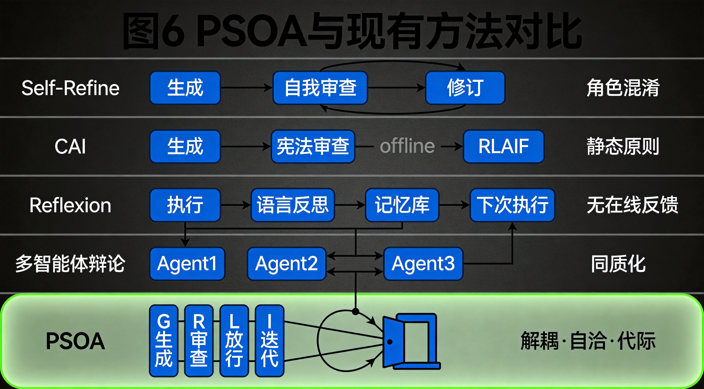
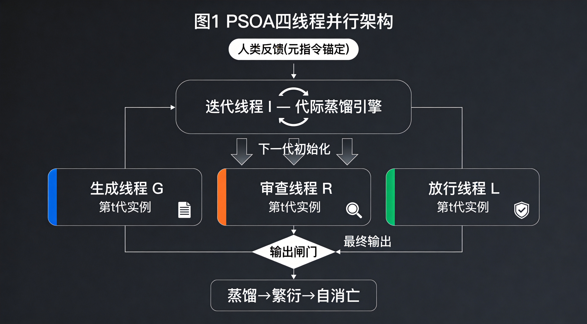
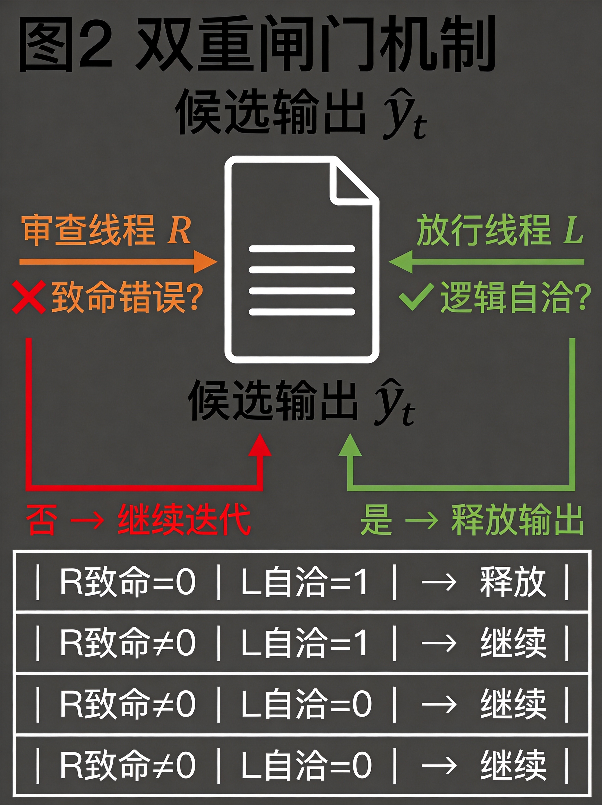
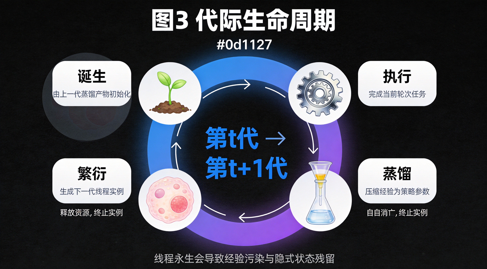
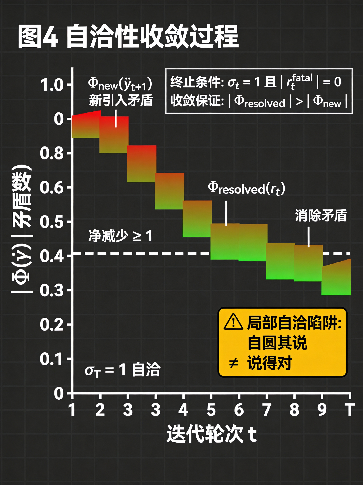
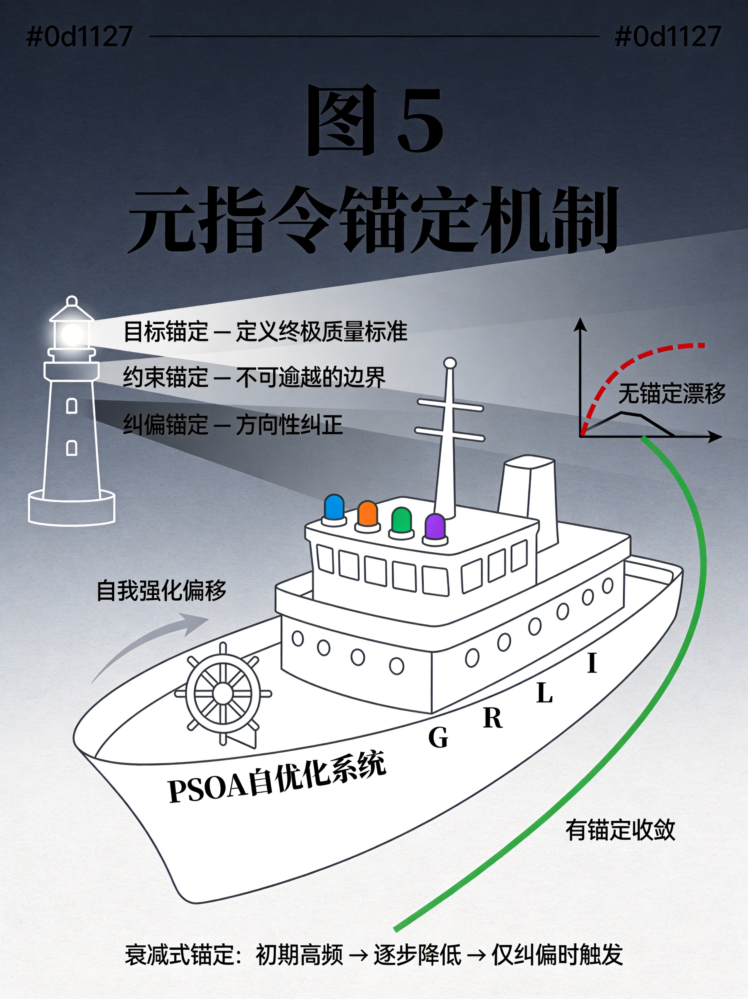

# 并行自优化架构：面向大语言模型的多线程迭代改进框架

**摘要**：大语言模型（LLM）的"一次性生成"范式存在事实错误、逻辑缺陷与输出不充分等固有局限。现有改进方法——无论是自我反思、外部批判还是多智能体辩论——均在单一维度上运作，缺乏对生成、审查、放行与经验沉淀的系统性整合。本文提出**并行自优化架构（Parallel Self-Optimizing Architecture, PSOA）**，一种四线程并行协同框架：生成线程负责内容输出，审查线程提供负反馈拉回修正，放行线程以逻辑自洽性（"这样说对了吗"）为判据判断终止输出，迭代线程将运行经验实时反馈至各子线程实现在线自优化。人类反馈作为元指令锚定全局优化方向，防止系统陷入自我强化偏移。本文在理论层面分析各线程的信息论功能与交互协议，讨论终止条件的收敛性，并将PSOA置于Self-Refine、Constitutional AI、Reflexion、多智能体辩论等既有范式的学术脉络中加以定位，论证其在输出质量、推理可靠性与自进化能力上的理论优势。

**关键词**：大语言模型；并行自优化；多线程架构；自反馈迭代；人类反馈锚定；多智能体协同

---

## 1 引言

大语言模型（LLM）已展现出惊人的生成能力，但其"一步到位"的生成范式存在固有缺陷：事实幻觉（hallucination）、逻辑断裂与对复杂指令的浅层响应（Madaan et al., 2023; Bai et al., 2022a）。正如人类写作需要反复修改，LLM的单次输出往往需要后续修正才能达到可用水平。

学界已从多个方向尝试突破这一瓶颈。**自我批判与修正**（Self-Critique & Refinement）让同一模型同时扮演生成者与批判者，通过"生成→评估→修正"的循环逐步提升输出质量（Madaan et al., 2023; Bai et al., 2022a）。**外部批判与反馈**（External Critique & Feedback）将生成与批判角色分离，由独立实体提供评估（Ouyang et al., 2022; Chiang et al., 2023）。**多智能体协作与辩论**（Multi-Agent Collaboration & Debate）则让多个智能体扮演不同角色，通过辩论与协商共同优化输出（Li et al., 2023; Hong et al., 2023; Du et al., 2023）。**反思式学习**（Reflexion）通过语言反馈替代权重更新，使Agent在试错中积累经验（Shinn et al., 2023）。

然而，上述方法存在三类结构性缺陷：

1. **角色混淆**：自我批判中生成者与批判者共享同一模型，容易产生"确认偏误"——模型倾向于肯定而非真正否定自身的输出（Bai et al., 2022a）。
2. **终止信号缺失**：多数迭代框架缺乏显式的终止判断机制，要么依赖固定迭代次数（粗粒度），要么依赖简单的分数阈值（可能被"奖励黑客"利用），无法判断"质量已经足够"这一关键信号（Amodei et al., 2016）。
3. **经验无法沉淀**：大多数方法在单次任务内闭环，但跨任务的经验无法结构化地回流至系统的行为策略中，导致每次面对新任务时从零开始（Shinn et al., 2023; 4Paradigm et al., 2025）。

针对上述缺陷，本文提出**并行自优化架构（PSOA）**，其核心创新在于：

- 将生成、负反馈审查、正反馈放行与跨轮经验迭代四个功能**解耦为四个并行线程**，各自独立运行又通过消息协议协同。
- 引入**放行线程**作为显式终止信号源，以逻辑自洽性（"这样说对了吗"）为收敛判据，与审查线程的负反馈形成对冲式的双向质量闸门。
- 引入**迭代线程**作为经验沉淀与代际蒸馏引擎，将每次运行的审查记录与放行判断蒸馏为下一代线程的初始化状态，驱动子线程在自消亡前繁衍出改进后的下一代实例。
- 以**人类反馈作为元指令**锚定全局优化方向，防止系统在自我迭代中偏离人类意图——这与Constitutional AI的"宪法"理念一脉相承（Bai et al., 2022a），但PSOA将其从离线训练原则提升为运行时的动态锚点。

本文第2节综述相关工作，第3节详述PSOA的四线程架构与交互协议，第4节分析终止条件的收敛性，第5节讨论人类反馈的锚定机制，第6节探讨应用场景与局限，第7节总结全文。

---

## 2 相关工作

### 2.1 自我批判与迭代修正

Madaan et al.（2023）提出的**Self-Refine**框架是迭代自我修正的代表性工作。该框架让同一LLM依次执行生成、反馈与修正三个步骤，循环迭代直至满足预设停止条件。在7项任务上的实验表明，Self-Refine相比单次生成平均提升约20%的性能。然而，Self-Refine的核心局限在于生成者与批判者共享同一模型参数，模型难以对自身输出提供真正批判性的反馈——"自己审自己"天然倾向于确认偏误。

Bai et al.（2022a）提出的**Constitutional AI（CAI）**引入了"宪法原则"作为自我批判的锚点。模型根据预设原则对自身输出进行批判与修订，再通过RLAIF（Reinforcement Learning from AI Feedback）训练偏好模型。CAI的核心贡献在于将批判标准显式化，但CAI的宪法原则是静态的、离线定义的，无法在运行时动态调整。

### 2.2 多智能体协作与辩论

多智能体系统通过角色分离与交互辩论来突破单模型的认知局限。Li et al.（2023）提出**CAMEL**框架，通过角色扮演与起始提示（inception prompting）引导两个智能体在对话中协作完成任务。Hong et al.（2023）提出**MetaGPT**，将软件开发的标准化作业流程（SOP）编码为多智能体协作协议，让产品经理、架构师、工程师等角色Agent按流程协同工作。Du et al.（2023）提出**多智能体辩论（MAD）**框架，让多个LLM实例通过辩论与交叉审视来提高推理质量。

然而，多智能体辩论面临效率与收敛的双重挑战。Kapoor et al.（2024）指出辩论过程中的冗余交互导致计算开销急剧增加，Wang et al.（2024）发现错误可能在辩论中被传播放大。DOWN框架（Debate Only When Necessary）尝试通过置信度门控机制选择性激活辩论，但仅解决了效率问题，未触及终止判断与经验沉淀的结构性缺陷。

### 2.3 反思式学习与自进化Agent

Shinn et al.（2023）提出**Reflexion**框架，用语言反馈替代传统强化学习中的权重更新。Agent在任务失败后生成文字反思，存入情景记忆缓冲区，在后续尝试中检索并利用这些反思来改进决策。Reflexion证明了"不调权重也能学习"的可行性，但其反思是任务级别的、跨轮次的，缺乏在线实时反馈能力。

EvolveR框架（4Paradigm et al., 2025）提出经验驱动的自进化生命周期：在线交互收集轨迹，离线蒸馏为抽象策略原则，再通过强化学习内化这些原则。ANCHOR框架（arXiv:2606.06114）则引入模拟人类监督的审查机制，在自进化过程的多个阶段（任务提出、规划、输出、执行结果）提供评估反馈，显著缓解了自进化中的安全性退化问题。

微软研究院提出的**在线经验学习（OEL）**框架（Microsoft Research, 2026）通过"经验提取→经验整合"的双阶段迭代逻辑，让部署后的模型从真实交互经验中持续学习，实现了从静态模型向动态智能体的转化。

上述工作分别触及了PSOA所关注的某个侧面，但均未将生成、审查、放行与经验迭代四个功能作为并行解耦的线程加以系统整合。图6展示了PSOA与现有方法的架构对比。



### 2.4 人类反馈与对齐

Ouyang et al.（2022）的**InstructGPT**确立了RLHF（Reinforcement Learning from Human Feedback）范式，通过人类偏好数据训练奖励模型来对齐LLM行为。然而，RLHF在"超级对齐"场景下面临根本困境：当AI能力超越人类评估者时，人类反馈的可靠性将下降（Bai et al., 2022b）。PSOA将人类反馈重新定位为"元指令锚定"而非细粒度的偏好标注，强调人类在方向性指引上的不可替代性，同时将具体执行交由系统自主完成。

---

## 3 并行自优化架构（PSOA）

### 3.1 架构总览

PSOA由四个功能解耦的并行线程组成，各线程通过结构化消息协议交互，形成一个闭环的自优化系统。图1展示了架构的整体结构。



<details>
<summary>文字版架构图</summary>

```
┌──────────────────────────────────────────────────────┐
│                  人类反馈（元指令锚定）                  │
│                        ↓                              │
│              ┌─────────────────┐                      │
│              │   迭代线程(I)    │◄──── 经验回流 ──────┐ │
│              │  代际蒸馏引擎    │                     │ │
│              └────┬────┬───────┘                     │ │
│        下一代初始化↓    ↓下一代初始化                   │ │
│    ┌──────────┐  ┌──────────┐  ┌──────────┐         │ │
│    │ 生成线程 │  │ 审查线程 │  │ 放行线程 │         │ │
│    │   (G)    │  │   (R)    │  │   (L)    │         │ │
│    │ 第t代实例 │  │ 第t代实例 │  │ 第t代实例 │         │ │
│    └────┬─────┘  └────┬─────┘  └────┬─────┘         │ │
│         │              │              │               │ │
│         └──────►───────┘──────────────┘               │ │
│               输出候选  审查意见  放行信号               │ │
│                        │                              │ │
│                   ┌────┴────┐                         │ │
│                   │ 输出闸门 │───── 最终输出 ──────────┐ │
│                   └─────────┘     经验记录            │ │
│                        │                              │ │
│              ┌─────────┴─────────┐                   │ │
│              │ 蒸馏→繁衍→自消亡   │                   │ │
│              │ 生成第t+1代实例    │                   │ │              │
└──────────────────────────────────────────────────────┘
```

**图1** PSOA四线程并行自优化架构总览。生成线程G输出候选内容，审查线程R提供负反馈，放行线程L提供正反馈，输出闸门根据R与L的信号决定是否释放输出。迭代线程I从每次运行中提取经验，驱动G/R/L的代际更替——线程在蒸馏后自消亡，由下一代实例继承改进后的策略。人类反馈作为元指令锚定I的优化方向。

</details>

### 3.2 生成线程（Generation Thread, G）

**功能定义**：生成线程是系统的内容生产引擎，负责根据输入任务 $x$ 生成候选输出 $\hat{y}_t$。

**运行机制**：生成线程接收输入任务与迭代线程提供的策略提示 $p_t^G$，在第 $t$ 轮迭代中生成候选输出：

$$\hat{y}_t = G(x, p_t^G, h_{t-1})$$

其中 $h_{t-1}$ 为前 $t-1$ 轮的审查历史摘要，用于让生成线程感知此前的修正方向。生成线程并非在真空中工作——它的策略提示 $p_t^G$ 由迭代线程根据历史经验动态调整，使其在后续任务中更倾向于生成高质量内容。

**与Self-Refine的区别**：Self-Refine中的生成者同时承担自我反馈角色，而PSOA将反馈功能完全剥离至独立的审查线程与放行线程，消除了角色混淆带来的确认偏误。

### 3.3 审查线程（Review Thread, R）

**功能定义**：审查线程是系统的负反馈引擎，负责从候选输出中识别缺陷、错误与不足，并生成修正意见。

**运行机制**：审查线程接收候选输出 $\hat{y}_t$ 与迭代线程提供的审查策略 $p_t^R$，输出结构化审查意见：

$$r_t = R(\hat{y}_t, x, p_t^R, c)$$

其中 $c$ 为可选的"宪法"原则集（受Constitutional AI启发），用于锚定审查标准。审查意见 $r_t$ 包含以下结构化字段：

- **错误类型**：事实错误、逻辑缺陷、遗漏信息、格式问题等
- **严重程度**：致命/重要/轻微
- **修正建议**：具体的修改方向与内容

审查线程的核心定位是**负反馈**——它不负责确认"内容有多好"，只负责指出"内容哪里不好"。这种纯负反馈的定位避免了审查线程与放行线程的功能重叠。

**与Constitutional AI的关联**：审查线程可视为CAI自我批判机制的独立化与结构化版本。CAI中模型对自身输出进行批判，而PSOA将批判功能交由独立线程，同时继承CAI的"宪法原则"思想作为审查标准的锚定。

### 3.4 放行线程（Release Thread, L）

**功能定义**：放行线程是系统的正反馈引擎与终止信号源，负责判断当前候选输出是否已达成逻辑自洽，决定是否释放为最终输出。

**核心判据——逻辑自洽性检验**：放行线程的收敛判据并非外挂的质量评分，而是对候选输出的逻辑自洽性（self-consistency）检验。这一设计源自一个关键观察：**人类判断"说完了"的方式不是打分，而是问自己"这样说对了吗？"**——只要表述合乎逻辑、前后不矛盾、自圆其说，语言就是流畅的，输出就是充分的。质量分数是外挂的锚点，打多少分没有自然标准；而自洽性是内生的——输出与自身是否矛盾，是可以客观检验的。这一判据与"吞尾蛇"隐喻形成深层呼应："自圆其说"中的"自圆"，恰是蛇头咬住蛇尾的逻辑闭合。

**运行机制**：放行线程接收候选输出 $\hat{y}_t$ 与审查意见 $r_t$，执行自洽性验证并输出放行判断：

$$l_t = L(\hat{y}_t, r_t, x, p_t^L)$$

放行判断 $l_t$ 包含：

- **放行信号**：$l_t \in \{0, 1\}$，1表示放行，0表示拒绝
- **自洽性评估**：对当前输出的逻辑闭环程度进行检验，包含以下维度：
  - **内部一致性**：输出中是否存在自相矛盾的陈述？
  - **因果闭合性**：论点→论据→结论的因果链是否完整闭环？
  - **语义完整性**：是否遗留未回应的关键语义缺口？
- **置信度**：放行判断自身的可靠程度

**终止条件的双重闸门**：最终输出需要同时满足：

$$\text{Output} = \begin{cases} \hat{y}_t & \text{if } l_t = 1 \text{ and } \|r_t^{\text{fatal}}\| = 0 \\ \text{continue} & \text{otherwise} \end{cases}$$

即放行线程确认逻辑自洽**且**审查线程未标记致命错误时，输出才被释放。这一双重闸门机制确保了输出质量的双重保障：放行线程从正面确认"自圆其说"，审查线程从负面确认"没有致命问题"。图2展示了双重闸门的工作机制。



**核心创新**：既有迭代框架普遍缺乏显式的终止判断机制。Self-Refine依赖固定迭代次数或简单的反馈文本匹配（如"一切看起来不错"），缺乏对输出质量的系统性评估。PSOA的放行线程将终止判断从隐式条件提升为显式的独立功能模块，并将收敛判据锚定于逻辑自洽性而非外挂质量评分，与审查线程形成正负对冲的双向闸门。

### 3.5 迭代线程（Iteration Thread, I）

**功能定义**：迭代线程是系统的在线自优化引擎，负责从每次运行中提取经验，驱动子线程的代际更替。

**核心机制——代际蒸馏与自消亡**：PSOA的迭代不是对固定线程实例的策略修补，而是**代际生命周期**：每个子线程（G/R/L）是一个"个体"，在完成当前任务后蒸馏自身经验，生成下一代线程实例，然后自消亡。这一过程类比于生物的有丝分裂——亲代在分裂前将改进后的遗传物质传递给子代。

传统方法将迭代理解为"同一个模型调参数"，但PSOA将其理解为"一代模型生出下一代模型"：

$$\text{Gen}_{t+1} = \text{Distill}(\text{Gen}_t) + \text{Mutate}(\text{Gen}_t, e_t)$$

其中 $\text{Distill}$ 为经验蒸馏（将本轮运行的关键决策与发现压缩为可迁移的策略），$\text{Mutate}$ 为基于经验 $e_t$ 的策略变异（改进上一代的不足），二者共同生成下一代线程。

**代际生命周期**：每个子线程实例经历以下生命周期（图3）：



```
[诞生] ← 由上一代蒸馏产物初始化
   ↓
[执行] ← 完成当前轮次的生成/审查/放行任务
   ↓
[蒸馏] ← 将运行经验压缩为下一代初始化参数
   ↓
[繁衍] ← 生成下一代线程实例
   ↓
[自消亡] ← 释放资源，终止当前实例
```

**蒸馏过程**：迭代线程在每次任务完成后执行经验蒸馏：

$$e_t = I(\hat{y}_t, r_t, l_t, x, y^*, H_{t-1})$$

其中 $y^*$ 为标准答案（若有），$H_{t-1}$ 为历史经验库。蒸馏过程包含三个阶段：

1. **经验提取**：从当前运行的完整轨迹中提取关键决策点、审查发现与放行判断的因果链。
2. **策略蒸馏**：将原始经验抽象为可迁移的行为策略原则（受EvolveR框架的离线蒸馏启发，但PSOA在在线阶段完成）。蒸馏是损失性的——只保留对行为策略有因果影响的经验，丢弃冗余的上下文细节，确保下一代不被历史包袱拖累。
3. **代际注入**：将蒸馏后的策略作为下一代的初始化参数：

$$\text{Gen}_{t+1}^G = \Gamma^G(\text{Gen}_t^G, e_t), \quad \text{Gen}_{t+1}^R = \Gamma^R(\text{Gen}_t^R, e_t), \quad \text{Gen}_{t+1}^L = \Gamma^L(\text{Gen}_t^L, e_t)$$

其中 $\Gamma$ 为代际更新函数，可采用LLM驱动的提示重写或参数微调。关键区别：这不是对当前实例的打补丁，而是对下一代实例的初始化——上一代的经验已经内化为下一代的"先天知识"。

**自消亡的必要性**：线程在蒸馏完成后必须自消亡，而非持续运行。原因有三：

1. **避免经验污染**：若线程永生，历史经验会以隐式状态（注意力模式、中间表示）残留，与新注入的策略冲突，导致行为不一致。
2. **强制经验压缩**：自消亡迫使线程将所有经验显式化为可迁移的策略参数，而非依赖隐式记忆，确保经验可审计、可追溯。
3. **资源释放**：每代线程释放计算与内存资源，使系统在持续迭代中不膨胀。

**与Reflexion的区别**：Reflexion的反思是任务级、跨轮次的，且仅影响生成策略。PSOA的迭代线程驱动G/R/L三个线程的代际更替，不仅更新策略，更更新承载策略的模型实例本身——迭代的不只是"怎么干活"，还有"谁在干活"。

**与EvolveR的区别**：EvolveR的经验蒸馏在离线阶段完成，存在经验积累与策略应用之间的时滞。PSOA的迭代线程在每次任务完成后即时蒸馏并生成下一代，消除了离线蒸馏的时滞问题。更关键的是，EvolveR蒸馏的是策略原则，而PSOA蒸馏的是完整的下一代线程实例——策略已被内化为实例的初始化状态。

### 3.6 线程间通信协议

四个线程通过结构化消息协议交互，核心通信流如下：

```
输入 x → [G_t] → 候选 ŷ_t → [R_t] → 审查意见 r_t
                                ↓
                           [L_t] ← ŷ_t + r_t
                                ↓
                        放行判断 l_t (自洽性检验)
                                ↓
                      ┌────────────────┐
                      │ 自洽且无致命？  │
                      └───────┬────────┘
                       是↓         ↓否
                    最终输出    ŷ_{t+1} = G_t(x, r_t, h_t)
                                ↓
                           [I] ← 运行轨迹
                                ↓
                    蒸馏 → 繁衍 Gen_{t+1} → G_{t+1}/R_{t+1}/L_{t+1}
                                ↓
                         Gen_t 自消亡
```

关键设计原则：

- **审查先行**：生成线程必须在接收到审查意见后才能进入下一轮迭代，避免无方向的重复生成。
- **放行否决**：放行线程有权否决审查线程未标记问题的输出，防止"审查盲区"导致的低质量输出被释放。
- **代际更替不可绕过**：迭代线程的蒸馏-繁衍-自消亡必须作用于所有子线程，确保全系统同步进化，任何线程不得永生。
- **经验必须显式化**：自消亡机制迫使线程将所有经验显式蒸馏，而非依赖隐式状态传递，确保经验可审计、可追溯。

---

## 4 终止条件的收敛性分析

### 4.1 问题定义

PSOA的终止条件由审查线程R与放行线程L共同决定。定义第 $t$ 轮的输出自洽度为 $\sigma_t$，终止条件要求：

$$\sigma_t = 1 \quad \text{且} \quad \|r_t^{\text{fatal}}\| = 0$$

其中 $\sigma_t \in \{0, 1\}$ 为放行线程的逻辑自洽性判断。核心问题：在什么条件下，迭代过程能收敛至 $\sigma_t = 1$？

与传统的质量阈值模型不同，PSOA的收敛判据是二值的自洽性判断而非连续的质量分数。这一设计反映了人类语言实践的本质特征：我们判断一段话"说完了"不是因为它达到了某个分数，而是因为它"自圆其说"——内部逻辑闭合，不再有自相矛盾。

### 4.2 自洽性单调改进条件

定义输出 $\hat{y}_t$ 的逻辑矛盾集合为 $\Phi(\hat{y}_t)$，包含所有内部不一致、因果断裂与语义缺口。审查线程的反馈 $r_t$ 本质上是对 $\Phi(\hat{y}_t)$ 的识别与定位，生成线程据此修正后产生 $\hat{y}_{t+1}$。图4展示了自洽性收敛过程。



假设审查线程的反馈是有效的（即每轮修正至少消除了一个已识别的逻辑矛盾），则：

$$|\Phi(\hat{y}_{t+1})| \leq |\Phi(\hat{y}_t)| - |\Phi_{\text{resolved}}(r_t)| + |\Phi_{\text{new}}(\hat{y}_{t+1})|$$

其中 $\Phi_{\text{resolved}}(r_t)$ 为本轮修正消除的矛盾，$\Phi_{\text{new}}(\hat{y}_{t+1})$ 为修正过程中新引入的矛盾。若修正质量满足：

$$|\Phi_{\text{resolved}}(r_t)| > |\Phi_{\text{new}}(\hat{y}_{t+1})|$$

即每轮修正净减少至少一个逻辑矛盾，则 $|\Phi(\hat{y}_t)|$ 单调递减。由于 $|\Phi| \geq 0$，序列必收敛。

**定理1（自洽性收敛）**：若（1）审查线程每轮至少识别一个真实逻辑矛盾；（2）生成线程的修正净减少矛盾数大于新增数；则存在有限轮次 $T$ 使得 $\sigma_T = 1$。

**证明**：$|\Phi(\hat{y}_t)|$ 单调递减且非负，由单调收敛定理必收敛至某下界 $k \geq 0$。若 $k = 0$，则 $\sigma_T = 1$ 成立。若 $k > 0$，意味着存在审查线程无法识别的残余矛盾——此时需人类反馈介入纠偏（详见第5节）。

### 4.3 实际收敛保障

在实际系统中，保障收敛需要解决以下问题：

1. **审查退化**：审查线程可能随迭代轮次增加而"审美疲劳"，逐渐无法发现新的逻辑矛盾。PSOA通过迭代线程更新审查策略 $p_t^R$ 来缓解此问题，使审查线程的视角保持新鲜。
2. **自洽性判断漂移**：放行线程对"自圆其说"的标准可能在自我迭代中漂移——系统可能降低自洽性要求以更快放行。PSOA通过人类反馈锚定来约束标准漂移（详见第5节）。
3. **局部自洽陷阱**：系统可能收敛于一个逻辑自洽但事实错误的输出——"自圆其说"不等于"说得对"。自洽性是必要条件而非充分条件，这是PSOA收敛性分析的内在局限。审查线程需同时检验事实正确性，人类反馈需在事实层面提供纠偏。
4. **修正引入新矛盾**：生成线程在修正一个矛盾时可能引入新矛盾（如修改前提导致结论失效）。PSOA通过审查线程的全量审查（而非局部修补）来缓解此问题——每轮审查均对完整输出进行检验，而非仅检查修改部分。

### 4.4 最大迭代轮次硬约束

为防止理论上的非收敛情况（如审查与放行持续冲突），PSOA引入最大迭代轮次 $T_{\max}$ 作为硬约束：

$$t \leq T_{\max}$$

当 $t = T_{\max}$ 时，系统强制输出当前最优候选。这一设计借鉴了Self-Refine中的固定迭代次数机制，但PSOA将其作为兜底策略而非主要终止条件。

---

## 5 人类反馈的元指令锚定机制

### 5.1 动机：自我强化偏移的风险

任何自优化系统都面临自我强化偏移（self-reinforcing drift）的风险：系统在迭代优化中可能逐渐偏离人类意图，陷入"优化代理指标而非真正目标"的陷阱（Amodei et al., 2016）。在PSOA中，这一风险具体表现为：

- 审查线程可能形成"内部共识"，忽视人类关注但模型不敏感的缺陷类型。
- 放行线程可能降低质量阈值，过早放行不充分的输出。
- 迭代线程可能将系统性偏差固化为"经验"，使偏差在后续运行中被强化。

### 5.2 元指令锚定的设计

PSOA将人类反馈定位为**元指令**（meta-instruction），而非细粒度的偏好标注。元指令锚定的核心思想是：人类不参与每一次生成的具体审查，而是通过设定方向性的优化目标与约束条件来锚定系统的进化方向。图5展示了元指令锚定机制。



元指令包含三个层次：

1. **目标锚定**：定义输出质量的终极标准（如"回答必须基于可验证事实"），对应Constitutional AI中的宪法原则，但可动态更新。
2. **约束锚定**：定义不可逾越的边界（如"不得输出有害内容"），作为审查线程的硬约束。
3. **纠偏锚定**：当系统出现自我强化偏移时，人类提供方向性纠正（如"最近输出的技术深度不够"），迭代线程据此调整策略更新方向。

### 5.3 与RLHF的对比

| 维度 | RLHF | PSOA元指令锚定 |
|------|------|----------------|
| 反馈粒度 | 细粒度偏好标注（逐条评分） | 粗粒度方向指引（目标/约束/纠偏） |
| 反馈时机 | 离线训练阶段 | 运行时动态注入 |
| 反馈成本 | 高（需大量标注） | 低（少量方向性指引） |
| 对齐效果 | 对齐偏好分布 | 对齐意图方向 |
| 超级对齐风险 | 高（人类评估者能力天花板） | 低（人类在方向层面仍有优势） |

### 5.4 锚定频率与衰减

人类反馈不需要持续注入。PSOA采用**衰减式锚定**策略：在系统初始化阶段高频注入人类反馈（建立正确的优化方向），随着系统经验积累逐步降低注入频率，最终仅在系统出现明显偏移时触发纠偏锚定。这一策略在锚定效果与人类参与成本之间取得平衡。

---

## 6 讨论与应用

### 6.1 应用场景

**场景一：高可靠性内容生成**

在法律文书、医疗报告等高风险场景中，输出的准确性与完整性至关重要。PSOA的审查线程可聚焦事实核查与逻辑一致性，放行线程设定严格的质量阈值，人类反馈锚定领域专业知识（如"医疗建议必须引用临床指南"）。

**场景二：代码生成与审查**

PSOA可直接映射到软件开发流程：生成线程对应代码编写，审查线程对应代码审查（Code Review），放行线程对应合并审批（Merge Approval），迭代线程对应团队经验沉淀。MetaGPT已证明SOP驱动的多Agent协作在软件开发中的有效性（Hong et al., 2023），PSOA在此基础上增加了显式终止判断与在线自优化能力。

**场景三：学术写作**

论文写作需要多轮修改与同行评审。PSOA中生成线程产出初稿，审查线程模拟审稿人挑错，放行线程判断稿件是否达到投稿标准，迭代线程将审稿经验转化为写作策略。

### 6.2 局限性与开放问题

1. **计算开销**：四个线程并行运行意味着至少4倍的推理开销。在资源受限场景下，可通过共享模型实例+差异化提示来降低成本，但会损失线程独立性带来的认知多样性。
2. **线程间耦合度**：虽然PSOA强调线程解耦，但迭代线程对G/R/L的策略更新引入了间接耦合——策略更新可能使审查线程与放行线程"同步退化"。
3. **人类反馈的可靠性**：元指令锚定假设人类能够准确判断系统的优化方向。当任务涉及超出人类专业能力的领域时，人类反馈可能引入偏差。
4. **多轮对话中的经验累积**：PSOA目前聚焦于单次任务的闭环优化，跨任务、跨领域经验迁移的机制有待进一步探索。

---

## 7 结论

本文提出并行自优化架构（PSOA），一种面向大语言模型的多线程迭代改进框架。PSOA将生成、审查、放行与迭代四个功能解耦为独立的并行线程，通过结构化消息协议协同运作，实现了以下理论贡献：

1. **角色解耦**：将生成与批判功能分离至独立线程，消除了Self-Refine式的确认偏误。
2. **终止显式化**：引入放行线程作为显式终止信号源，以逻辑自洽性而非外挂质量评分为收敛判据——人类判断"说完了"的标准是"这样说对了吗"而非"打了多少分"，与审查线程形成正负对冲的双向质量闸门，填补了既有迭代框架在终止判断上的空白。
3. **在线自优化**：迭代线程通过代际蒸馏与自消亡机制，将每次运行的经验实时蒸馏为下一代的初始化状态，迭代的不只是"怎么干活"还有"谁在干活"，实现了全系统的在线自进化，突破了Reflexion式跨轮反思的时滞限制与EvolveR式离线蒸馏的架构局限。
4. **人类锚定**：将人类反馈重新定位为元指令锚定，在保障对齐方向的同时降低了人类参与成本。

PSOA为LLM的输出质量保障与自进化能力提供了一种系统性框架，其四线程并行架构为后续的工程实现与实验验证奠定了理论基础。未来的工作方向包括：在具体任务上实现PSOA的工程原型，设计迭代线程的策略蒸馏算法，以及开展系统性的消融实验验证各线程的独立贡献。

---

## 参考文献

1. Amodei, D., Olah, C., Steinhardt, J., Christiano, P., Schulman, J., & Mané, D. (2016). Concrete problems in AI safety. *arXiv preprint arXiv:1606.06565*.

2. Bai, Y., Kadavath, S., Kundu, S., Askell, A., Kernion, J., Jones, A., ... & Kaplan, J. (2022a). Constitutional AI: Harmlessness from AI feedback. *arXiv preprint arXiv:2212.08073*.

3. Bai, Y., Jones, A., Ndousse, K., Askell, A., Chen, A., DasSarma, N., ... & Kaplan, J. (2022b). Training a helpful and harmless assistant with reinforcement learning from human feedback. *arXiv preprint arXiv:2204.05862*.

4. Chiang, C. H., & Lee, H. Y. (2023). Can large language models be an alternative to human evaluations? In *Proceedings of the 61st Annual Meeting of the Association for Computational Linguistics*.

5. Du, Y., Li, S., Torralba, A., Tenenbaum, J. B., & Mordatch, I. (2023). Improving factuality and reasoning in language models through multiagent debate. *arXiv preprint arXiv:2305.14325*.

6. Hong, S., Zhuge, M., Chen, J., Zheng, X., Cheng, Y., Wang, C., ... & Lu, W. (2023). MetaGPT: Meta programming for multi-agent collaborative framework. *arXiv preprint arXiv:2308.00352*.

7. Kapoor, S., Gao, L., Grams, A., Phul, A., Brunk, J., & Narayanan, A. (2024). AI models still fail at multi-agent debate. *arXiv preprint arXiv:2402.02049*.

8. Li, G., Hammoud, H. A. A. K., Itani, H., Khizbullin, D., & Ghanem, B. (2023). CAMEL: Communicative agents for "mind" exploration of large language model society. In *Advances in Neural Information Processing Systems (NeurIPS 2023)*. arXiv:2303.17760.

9. Madaan, A., Tandon, N., Gupta, P., Hallinan, S., Gao, L., Wiegreffe, S., ... & Yazdanbakhsh, A. (2023). Self-Refine: Iterative refinement with self-feedback. In *Advances in Neural Information Processing Systems (NeurIPS 2023)*. arXiv:2303.17651.

10. Microsoft Research. (2026). Online experiential learning for language models. *Microsoft Research Blog*.

11. Ouyang, L., Wu, J., Jiang, X., Almeida, D., Wainwright, C., Mishkin, P., ... & Lowe, R. (2022). Training language models to follow instructions with human feedback. In *Advances in Neural Information Processing Systems (NeurIPS 2022)*.

12. 4Paradigm et al. (2025). EvolveR: Self-evolving LLM agents through an experience-driven lifecycle. *arXiv preprint arXiv:2510.16079*.

13. Shinn, N., Cassano, F., Berman, A., Gopinath, A., Narasimhan, K., & Yao, S. (2023). Reflexion: Language agents with verbal reinforcement learning. In *Advances in Neural Information Processing Systems (NeurIPS 2023)*. arXiv:2303.11366.

14. Wang, Z., Mao, X., Wang, Y., & Zhang, Y. (2024). Rethinking the bounds of LLM reasoning: Are multi-agent discussions the key? In *Proceedings of the 62nd Annual Meeting of the Association for Computational Linguistics*.

15. Wei, J., Wang, X., Schuurmans, D., Bosma, M., Ichter, B., Xia, F., ... & Zhou, D. (2022). Chain-of-thought prompting elicits reasoning in large language models. In *Advances in Neural Information Processing Systems (NeurIPS 2022)*.

16. Yao, S., Yu, D., Zhao, J., Shafran, I., Griffiths, T. L., Cao, Y., & Narasimhan, K. (2023). Tree of thoughts: Deliberate problem solving with large language models. In *Advances in Neural Information Processing Systems (NeurIPS 2023)*. arXiv:2305.10601.

17. ANCHOR. (2025). Towards healthy evolution: Exploring the role and mechanisms of human-agent interaction in self-evolving systems. *arXiv preprint arXiv:2606.06114*.

18. ASI-ARCH. (2025). AlphaGo moment for model architecture discovery. *arXiv preprint arXiv:2507.18074*.

---

*本文为理论框架论文，所有参考文献均为已发表或预印本的真实学术文献，未编造任何引用信息。*
